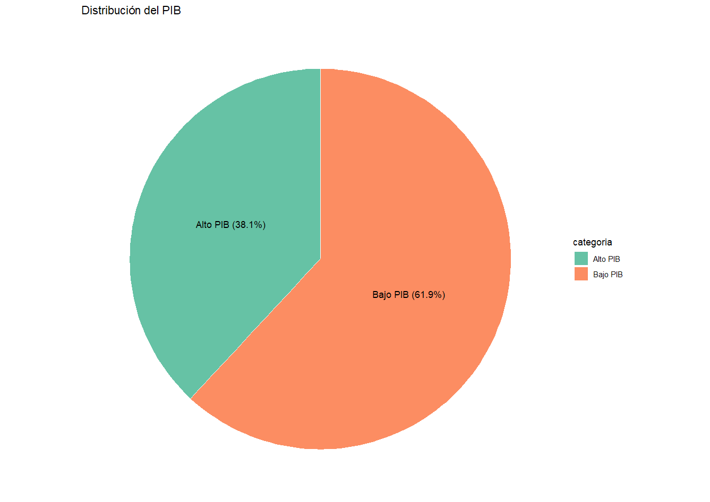
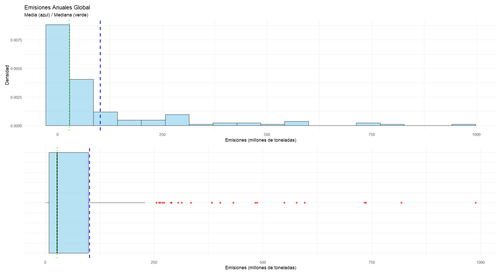

Informe Estadístico Descriptivo de Emisiones de CO₂ (2023)
================
Fábio da Silva Sanhudo
2025-10-27

# **Análisis descriptivo de las emisiones globales de CO₂ de combustibles fósiles en 2023: comparación entre países según el PIB per cápita (PPA - Paridad de Poder Adquisitivo)**

## **Introducción**

Este informe presenta un análisis descriptivo de las emisiones de
dióxido de carbono (CO₂) a la atmósfera durante el año 2023 para un
conjunto de países. El objetivo es comparar las características
principales (media, mediana, desviación típica, etc.) de las emisiones
entre dos grupos de países clasificados en función de su nivel de PIB
(Alto PIB vs. Bajo PIB). Los datos provienen del archivo CSV obtenido en
<https://ourworldindata.org/co2-emissions> y fueron proporcionados en el
fichero EmisionesCO2.csv (procesado para el año 2023).

## **Contexto de los datos**

El cambio climático y el aumento del efecto invernadero se han
convertido en uno de los principales desafíos globales. Las emisiones de
CO₂ son el principal indicador del impacto ambiental asociado a la
actividad económica y energética de los países. El análisis de estas
emisiones permite comprender las diferencias estructurales entre
economías desarrolladas (alto PIB) y economías en desarrollo (bajo PIB),
así como sus contribuciones relativas al calentamiento global. Los datos
analizados abarcan diversos países distribuidos en todos los
continentes. Cada registro incluye información sobre las emisiones
anuales de CO₂ y el nivel de PIB de cada país.

## **Objetivo del estudio**

El objetivo principal de este informe es realizar un análisis
comparativo de las emisiones totales de CO₂ en 2023 entre países de alto
y bajo PIB. Se busca identificar patrones, tendencias y diferencias
significativas en las emisiones entre los grupos, así como estimar la
variabilidad interna de cada grupo. Este análisis contribuye a una mejor
comprensión de la relación entre desarrollo económico y sostenibilidad
ambiental.

## **Alcance**

El estudio analiza las emisiones anuales totales de CO₂ por país (en
millones de toneladas) en una muestra de 147 países, clasificados en
nivel de PIB -alto o bajo- según el umbral del Banco Mundial. Solo se
realiza una descripción estadística básica, sin considerar emisiones per
cápita ni otros gases, ni hacer inferencias o proyecciones.

## **Metodología**

- **Fuente de datos:** El estudio usa el archivo *EmisionesCO2.csv*, con
  datos de emisiones globales de CO₂ (en millones de toneladas). Los
  países se clasificaron en Alto y Bajo PIB según el umbral de PIB per
  cápita (PPA) del Banco Mundial. Las fuentes son *Our World in Data*
  para emisiones y, el *Banco Mundial* para la clasificación económica.

- **Periodo analizado:** año 2023

- **Variables Estadísticas:**

- **Variable Cuantitativa - Emisiones de CO2**: Se ha analizado la
  variable estadística “Emisiones anuales de CO₂” por país (columna
  Emisiones_Anno_Millones_Toneladas, unidades: millones de toneladas en
  el archivo CSV).

- **Variable Cualitativa - Clasificación de países por PIB:** Los países
  se agruparon en dos categorías -Alto PIB y Bajo PIB- según la etiqueta
  textual de la columna *PIB*, basada en el umbral de PIB per cápita
  (PPA) definido por el Banco Mundial para 2023. Se excluyeron las
  etiquetas desconocidas, quedando 147 observaciones en total.

- **Análisis realizado:** estadísticas descriptivas por grupo: conteo,
  medidas de centralización, de dispersión, de localización, de forma y
  otras medias como los valores superiores e inferiores a la media.

- **Herramientas utilizadas:** El archivo original se actualizó con
  datos de *Our World in Data* y del *Banco Mundial*. El análisis se
  realizó en RStudio (versión 2025.09.00) usando los paquetes **e1071**,
  ***ggplot2*** y ***patchwork*** para el cálculo estadístico y la
  visualización.

## **Resultados**

A continuación, se muestran los resultados del análisis estadístico
descriptivo, de las emisiones de CO₂ en 2023 por grupo de PIB. Las
emisiones están expresadas en **millones de toneladas**.

**1. Medidas Estadísticas Descriptivas**

La tabla 1 presenta las principales medidas estadísticas de
centralización, dispersión, localización y forma para el total de países
y los grupos de Alto y Bajo PIB per cápita.

**Tabla 1.** Medidas Estadísticas Descriptivas

| Medida                        | Todos       | Países Alto PIB | Países Bajo PIB |
|-------------------------------|-------------|-----------------|-----------------|
| **Tamaño de Muestra**         | 147 países  | 56 países       | 91 países       |
| **Medidas de Centralización** |             |                 |                 |
| Media                         | 101.47 M    | 165.35 M        | 62.16 M         |
| Mediana                       | 27.26 M     | 63.86 M         | 11.90 M         |
| **Medidas de Dispersión**     |             |                 |                 |
| Mínimo                        | 1.10 M      | 4.14 M          | 1.10 M          |
| Máximo                        | 988.78 M    | 988.78 M        | 817.88 M        |
| Rango                         | 987.68 M    | 984.64 M        | 816.78 M        |
| Varianza                      | 30,693.72   | 43,877.59       | 18,876.57       |
| Desviación Estándar           | 175.20 M    | 209.47 M        | 137.39 M        |
| Coeficiente Variación         | 1.73        | 1.27            | 2.21            |
| **Medidas de Localización**   |             |                 |                 |
| Primer Cuartil                | 8.19 M      | 32.78 M         | 6.17 M          |
| Tercer Cuartil                | 99.40 M     | 261.96 M        | 42.77 M         |
| Rango Intercuartílico         | 91.22 M     | 229.18 M        | 36.60 M         |
| **Medidas de Forma**          |             |                 |                 |
| Coeficiente Asimetría         | 2.66        | 1.85            | 3.72            |
| Curtosis                      | 7.43        | 3.31            | 15.00           |
| **Otras Medidas**             |             |                 |                 |
| Valores \> media              | 36 (24.5%)  | 18 (32.1%)      | 17 (18.7%)      |
| Valores \< media              | 111 (75.5%) | 38 (67.9%)      | 74 (81.3%)      |

*Nota: Las emisiones en millones de toneladas, varianza en millones²*

- **Tablas de Contingencia**

La tabla 2 muestra la contingencia entre Emisiones de CO₂ y nivel de PIB
(Alto/Bajo), con emisiones agrupadas en 10 intervalos y frecuencias
absolutas (f) y relativas (h).

**Tabla 2.** Distribución de Países por Nivel de Emisiones de CO₂ vs PIB

| Rango de Emisiones (M ton) | Alto PIB  | Bajo PIB  | Total   | %        |
|----------------------------|-----------|-----------|---------|----------|
| \[0 - 5)                   | 1         | 16        | 17      | 11.6%    |
| \[5 - 15)                  | 7         | 31        | 38      | 25.9%    |
| \[15 - 30)                 | 2         | 17        | 19      | 12.9%    |
| \[30 - 60)                 | 18        | 8         | 26      | 17.7%    |
| \[60 - 120)                | 9         | 6         | 15      | 10.2%    |
| \[120 - 200)               | 1         | 6         | 7       | 4.8%     |
| \[200 - 350)               | 10        | 3         | 13      | 8.8%     |
| \[350 - 550)               | 4         | 2         | 6       | 4.1%     |
| \[550 - 800)               | 3         | 1         | 4       | 2.7%     |
| \[800 - 1000\]             | 1         | 1         | 2       | 1.4%     |
| **Total**                  | **56**    | **91**    | **147** |          |
| **%**                      | **38.1%** | **61.9%** |         | **100%** |

- **Tablas de Contingencia - Nivel de calificación en 4 intervalos
  (Baja, Media/Baja, Media/Alta y Alta emisión)**

La tabla 3 presenta la tabla de contingencia entre las variables
Emisiones de CO₂ y nivel del PIB (Alto/Bajo), donde las emisiones se
agrupan en cuatro intervalos: Baja Emisión (entre 0 y 30 millones), de
Media/Baja Emisión (entre 30 y 120), de Media/Alta Emisión (entre 120 y
550 millones) y Alta Emisión (entre 550 y 1000).

**Tabla 3.** Tabla de Contingencia - Emisiones de CO₂ vs Nivel de PIB

| Nivel de Emisiones        | Alto PIB  | Bajo PIB  | Total   | %        |
|---------------------------|-----------|-----------|---------|----------|
| Baja Emisión \[0-30)      | 10        | 64        | 74      | 50.3%    |
| Media/Baja \[30-120)      | 27        | 14        | 41      | 27.9%    |
| Media/Alta \[120-550)     | 15        | 11        | 26      | 17.7%    |
| Alta Emisión \[550-1000\] | 4         | 2         | 6       | 4.1%     |
| **Total**                 | **56**    | **91**    | **147** |          |
| **%**                     | **38.1%** | **61.9%** |         | **100%** |

- **Diagramas**

En la figura 1 se muestra el porcentaje de países de la muestra según su
nivel del PIB. El número total de países es de 147.

**Figura 1.** Porcentaje de Países según el PIB *per cápita*

<figure>

<figcaption aria-hidden="true"> </figcaption>
</figure>

En las figuras 2, 3 y 4 se muestran los histogramas y diagramas de caja
(*boxplot)* de la variable Emisiones de CO₂, en el caso de los
histogramas, agrupada en cuatro intervalos. En los diagramas aparecen
tanto la mediana (línea verde) como la media (línea azul).

   En las **figuras 5, 6 y 7** se
muestran los porcentajes de los países clasificados en 4 grupos de
Emisiones de CO₂ - Bajas Emisiones, Media/Bajas Emisiones, Media/Altas
Emisiones y Altas Emisiones.

**Figura 5.** Porcentaje de Emisiones de CO₂ - Globales 

**Figura 6.** Porcentaje de Emisiones de CO₂ - Países Alto PIB

**Figura 7.** Porcentaje de Emisiones de CO₂ - Países Bajo PIB

**Analisis de los Resultados**

### **1. Tamaño de muestra**

El conjunto total incluye **147 países**, de los cuales **56**
pertenecen al grupo de Países de A**lto PIB** y **91** al grupo de
países de B**ajo PIB**. Esta diferencia en tamaño muestral sugiere una
representación algo mayor de los países con bajo PIB, lo cual puede
influir en la distribución general de los datos.

### **2. Medidas de centralización**

- **De los datos obtenidos en la tabla 1**, podemos comprobar que la
  **media global** es de **101.47 millones de toneladas**, mientras que
  los países de **alto PIB** presentan una media significativamente
  superior (**165.35M de toneladas**) respecto a los de **bajo PIB**
  (**62.16M de toneladas**).  
  Esto indica que los países más ricos, en promedio, emiten casi **tres
  veces más de** CO₂ que los de bajo PIB.
- Las **medianas** (**27.26M de toneladas** para todos los países;
  **63.86M de toneladas** para países de alto PIB; **11.9M de
  toneladas** para países de bajo PIB) confirman esta tendencia, aunque
  también evidencian una **asimetría positiva**, pues las medianas son
  muy inferiores a las medias, lo que sugiere la presencia de **valores
  extremos altos (*outliers),*** como podemos verificar en los
  **histogramas y diagramas de caja de las figuras 2, 3, y 4**.

### **3. Medidas de dispersión**

- Observando los **rangos** y **desviaciones estándar** **en la tabla
  1**, comprobamos que son elevados, sobre todo en el grupo de países de
  alto PIB (**rango de 984.64M** **de toneladas** y **desviación de
  209.47M de toneladas**). Esto denota una **alta heterogeneidad**
  dentro de este grupo, donde coexisten países con valores muy elevados
  junto a otros moderados.
- El **coeficiente de variación (CV)** refuerza esta observación:
  - Alto PIB: CV = **1.27** → dispersión moderada.
  - Bajo PIB: CV = **2.21** → dispersión muy alta.
  - Global: CV = **1.73** → alta variabilidad.

Por lo tanto, los países de bajo PIB muestran una **variabilidad
relativa mucho mayor** en comparación con los de alto PIB.

### **4. Medidas de localización (cuartiles)**

- En los países de **alto PIB**, el **rango intercuartílico (IQR)**
  alcanza **229.18M de toneladas**, mientras que en los de **bajo PIB**
  es de solo **36.60M de toneladas**. Esto muestra que la **dispersión
  entre los valores centrales** (del 25% al 75%) es mucho más
  pronunciada en los países de alto PIB.
- Los **cuartiles** reflejan que el 75% de los países de bajo PIB no
  supera las **42.77M de toneladas**, mientras que el 75% de los de alto
  PIB están por debajo de **261.96M de toneladas**, evidenciando una
  brecha estructural importante.

### **5. Medidas de forma (asimetría y curtosis)**

- La **asimetría positiva** en todos los grupos (**2.66** general;
  **1.85** alto PIB; **3.72** bajo PIB) indica **distribuciones sesgadas
  hacia la derecha**: la mayoría de los países presentan valores bajos,
  pero existen algunos con valores extremadamente altos.
- La **curtosis** es elevada, especialmente en los países de **bajo PIB
  (15.00)**, lo que evidencia una **distribución leptocúrtica**:
  concentración alta alrededor de la media y presencia de ***outliers*
  muy alejados** (como podemos verificar en los **diagramas de caja de
  las figuras 2, 3, y 4**). En los países de alto PIB, la **curtosis es
  más moderada** (**3.31**), indicando una distribución más próxima a la
  normal.

### **6. Distribución respecto a la media**

- En el total de países, solo **24% de los valores** superan la media,
  lo que refuerza la idea de **asimetría positiva**.
- En **países de alto PIB, el 32% supera la media** (una distribución
  algo más equilibrada), mientras que **en los de bajo PIB apenas el 19%
  lo hace**, confirmando una **concentración de valores bajos** en este
  grupo.

### **7. Conclusión general**

En conjunto, los datos revelan que:

- Los **países de alto PIB** poseen **valores medios y medianos mucho
  mayores**, así como una **mayor dispersión absoluta**, aunque con
  **menor variabilidad relativa**.
- Los **países de bajo PIB** muestran **menores niveles medios** y una
  **distribución más sesgada y concentrada**, lo que sugiere
  desigualdades internas más pronunciadas.
- La **distribución general está fuertemente sesgada** y presenta
  ***outliers* significativos**, por lo que el uso de medidas robustas
  (como la mediana o el IQR) sería más apropiado que la media para
  representar tendencias centrales.

**Referencias:**

- Ritchie, H., & Roser, M. (2024, enero). *CO₂ emissions*. Our World in
  Data. <https://ourworldindata.org/co2-emissions>
- International Monetary Fund. (2025, Abril). *World Economic Outlook
  (WEO) Database - Changes to the Database*.
  <https://www.imf.org/en/Publications/WEO/weo-database/Changes>
  [IMF](https://www.imf.org/en/Publications/WEO/weo-database/Changes)
- Banco Mundial. (s. f.). \_PIB per cápita (constantes, PPA)
  <https://datos.bancomundial.org/indicador/NY.GDP.PCAP.CN>
